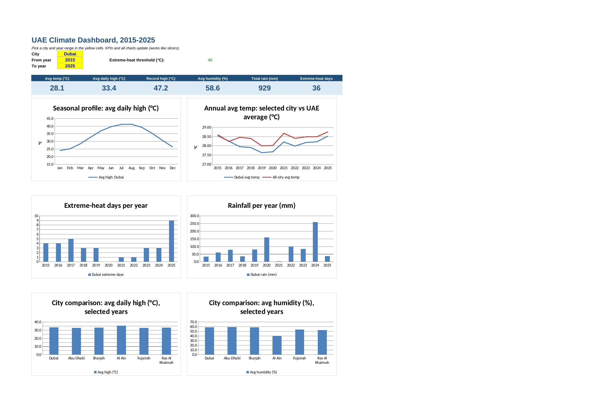
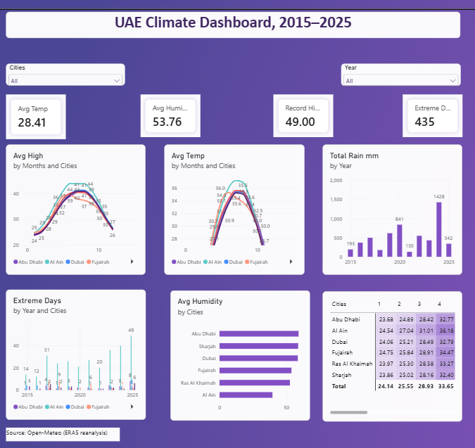

# UAE Climate Analysis (2015-2025)

An end-to-end analysis of daily temperature, humidity and rainfall in six UAE cities. Python collects the data, SQL analyses it, Excel reports on it and Power BI presents the dashboard.

| | |
|---|---|
| Cities | Dubai, Abu Dhabi, Sharjah, Al Ain, Fujairah, Ras Al Khaimah |
| Data | 24,108 daily records (6 cities x 4,018 days, 1 Jan 2015 to 31 Dec 2025) |
| Source | [Open-Meteo Historical Weather API](https://open-meteo.com), based on ERA5 reanalysis |
| Quality | No missing values or duplicates |

> Data caveat: Reanalysis is modelled gridded data, not readings from a single weather station. The figures are good for comparisons and patterns, but they are not official records. Peak events, such as single-day rainfall, tend to be smoothed.

## Tools

Python, SQL (SQLite), Excel (formulas, PivotTables, charts) and Power BI.

## Key findings

1. Al Ain is the hottest city by a wide margin. Its average daily high is 35.6°C, against 32.8-33.4°C elsewhere, and its summer (Jun-Sep) average high is 43.2°C. It also has the highest temperature in the data, 49.0°C.
2. Extreme heat is concentrated inland and rising there. Al Ain had 49 days at or above 45°C in 2025, up from 14 in 2015. Across all 11 years it had 300 such days, compared with 36 for Dubai and 6 for Ras Al Khaimah.
3. The longest heatwave was in Al Ain, from 11 Jul to 10 Aug 2025: 31 consecutive days at or above 43°C. A heatwave here means 3 or more consecutive days. The next-longest in any city was 9 days.
4. Coast and inland differ sharply. Summer humidity is about 31% in Al Ain versus 50-58% in the coastal cities. Coastal cities also cool less at night; Abu Dhabi's average summer low is 30.7°C.
5. Fujairah (east coast) has the mildest summer highs (37.7°C) and the most rain, about 117 mm a year versus 54 mm in Abu Dhabi.
6. 2024 was the wettest year in every city, driven by the storm of 16 April 2024 (113 mm in one day in Dubai in this dataset).
7. The warming signal is mixed. Comparing 2015-17 with 2023-25, Al Ain warmed by 0.81°C and Abu Dhabi by 0.33°C, while Ras Al Khaimah cooled by 0.47°C. With only 11 years of data, this shows variability rather than a statistically established trend.

## Repository structure

```
├── fetch_data.py                    # downloads the data from Open-Meteo
├── build_db.py                      # loads the CSV into SQLite and runs the queries
├── data/
│   └── uae_climate_raw.csv          # 24,108 daily rows
├── sql/
│   └── analysis_queries.sql         # 10 SQLite queries
├── excel/
│   └── uae_climate_analysis.xlsx    # 13-sheet workbook
├── powerbi/
│   └── uae_climate_dashboard.pbix   # Power BI dashboard
└── visuals/
    ├── .gitkeep
    ├── excel_dashboard_preview.png
    └── Powerbi_dashboard_preview.png
```

## SQL techniques used

- Aggregations and `CASE WHEN`
- CTEs
- Window functions: `RANK`, `ROW_NUMBER`, `LAG`, and rolling `AVG ... ROWS BETWEEN`
- A gaps-and-islands query to find consecutive-day heatwaves

## Excel workbook

The workbook has 13 sheets.

Dashboard. Yellow dropdown cells (city, from-year, to-year) drive 6 KPI cards and 6 charts, working like slicers. The extreme-heat threshold is an input on the `Extreme Heat` sheet.

PivotTables. Four views: month by city (with a year filter), year by city temperature, rainfall, and extreme-heat days.

Analysis sheets. City Summary, Monthly Profile (heatmap), Yearly Trend (heatmap and a 2015-17 vs 2023-25 comparison), Extreme Heat and Heatwaves.

Support sheets. Notes, DashData (chart helper tables) and Data (24,108 rows).

All summary figures are live formulas (`AVERAGEIFS`, `SUMIFS`, `COUNTIFS`, `MAXIFS`) over the Data sheet.



## How to reproduce

```
python fetch_data.py     # downloads data/uae_climate_raw.csv from Open-Meteo
python build_db.py       # loads it into data/uae_climate.db (SQLite) and runs all queries
```

`build_db.py` adds the `year` and `month` columns that the queries use. To run the queries yourself, open `data/uae_climate.db` in DB Browser for SQLite or the `sqlite3` command line, and paste from `sql/analysis_queries.sql`.

## Power BI dashboard



## Limitations

- The data is reanalysis, not official station records (see the caveat above).
- An 11-year window is too short for climate-trend conclusions.
- The heatwave thresholds (43°C for 3 or more days) are my own definition, chosen for this analysis.